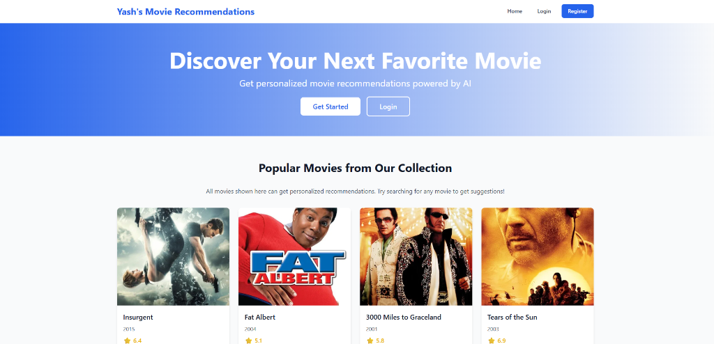

# � Movie Recommendation System

[](https://yashbmovie-recommendation.vercel.app/)
[](https://movie-recommendation-fxb0.onrender.com/api/health)



A full-stack movie recommendation application built with Flask (backend) and React (frontend). Get personalized movie recommendations based on content similarity using machine learning.

## � Live Demo
**[Click here to view the live application](https://yashbmovie-recommendation.vercel.app/)**

## ✨ Features

- 🎯 **Smart Recommendations**: Get movie suggestions based on content similarity
- 🔍 **Search Functionality**: Search for movies in our extensive database
- 📊 **Trending Movies**: Browse popular and trending movies
- 🎨 **Modern UI**: Beautiful, responsive interface built with React and Tailwind CSS
- 🔐 **User Authentication**: Register and login (optional for recommendations)

## �️ Tech Stack

### Backend
- **Flask**: Python web framework
- **Scikit-learn**: Machine learning for recommendations
- **Pandas & NumPy**: Data processing
- **MongoDB**: User data storage
- **TMDB API**: Movie metadata and posters

### Frontend
- **React**: UI framework
- **Tailwind CSS**: Styling
- **Axios**: HTTP client

## 📦 Local Installation

### Prerequisites
- Python 3.9+
- Node.js 14+
- Git LFS (Required for large model files)

### 1. Backend Setup

```bash
cd backend

# Install dependencies
pip install -r requirements.txt

# Run the server
python app.py
```
The backend will run on `http://localhost:5000`.

### 2. Frontend Setup

```bash
cd frontend

# Install dependencies
npm install

# Start the app
npm start
```
The frontend will run on `http://localhost:3000`.

## 🌐 Deployment

This project is deployed using a microservices architecture:

- **Frontend**: Hosted on **Vercel**
- **Backend**: Hosted on **Render**

### Environment Variables

**Backend (.env)**
```env
MONGODB_URI=your_mongodb_uri
JWT_SECRET_KEY=your_secret_key
FLASK_ENV=production
```

**Frontend (Vercel Environment Variables)**
```env
REACT_APP_API_URL=https://movie-recommendation-fxb0.onrender.com
```

## 🔑 API Endpoints

- `GET /api/health` - Health check
- `GET /api/trending` - Get trending movies
- `GET /api/search?q=query` - Search movies
- `POST /api/recommend` - Get recommendations
- `POST /api/register` - Register new user
- `POST /api/login` - Login user

## 🐛 Troubleshooting

**Large Files Issue:**
If you see errors about missing files, ensure Git LFS is installed:
```bash
git lfs install
git lfs pull
```

**Images Not Loading on Mobile:**
If movie posters don't show up on mobile data (but work on Wi-Fi), your mobile carrier might be blocking `image.tmdb.org`. Try using Wi-Fi or a VPN.

**Login Disabled on Live Demo:**
The live demo on Render does not have a persistent database attached. Therefore, **Login and Registration are disabled**. You can still use all recommendation features as a guest. To test authentication, please run the project locally.

## 👨‍💻 Author

**Yash**

## 📄 License

This project is open source and available under the MIT License.
